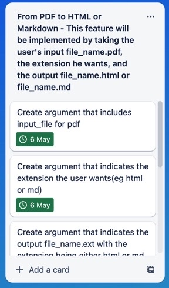
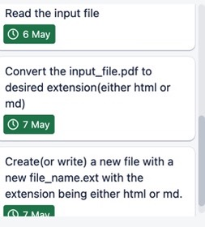
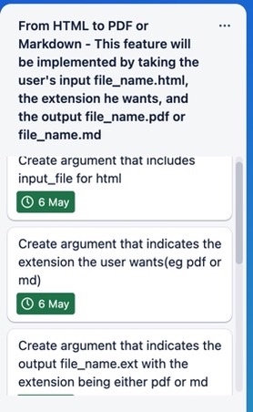
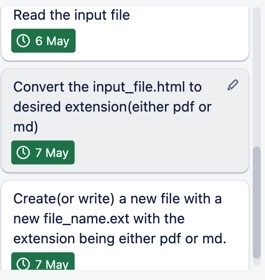
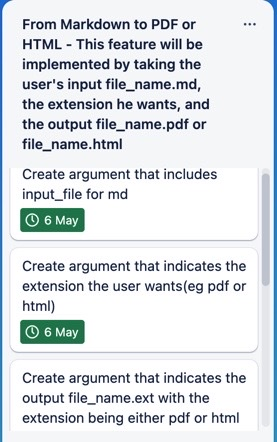
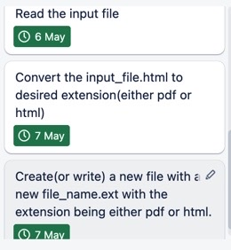

# Converter-Terminal-App

## Source Control Repository
https://github.com/eversometiculous/Converter-Terminal-App.git

Created using Python

## Features

This application is operable by Command Line Interface. It is a simple converter capable of taking the user's input file with its file_name.ext with acceptable extensions being .html, .pdf and .md. It will then convert the file to the output file format being either .html, .pdf and .md. It will also allow the user to choose what file name the user wants with the output file format.

From PDF to HTML or Markdown - This feature will be implemented by taking the user's input file_name.pdf, the extension he wants, and the output file_name.html or file_name.md

From HTML to PDF or Markdown - This feature will be implemented by taking the user's input file_name.html, the extension he wants, and the output file_name.pdf or file_name.md

From Markdown to PDF or HTML - This feature will be implemented by taking the user's input file_name.md, the extension he wants, and the output file_name.pdf or file_name.html

## Implementation Plan

Created using Trello by Atlassian. Link is here: https://trello.com/b/GADGv6cv/converter-app

### PDF to HTML or Markdown Task

### HTML to PDF to Markdown Task

### Markdown to HTML or PDF Task

## How to use this converter terminal application

### Steps

To use this application, a few steps need to be taken.

1. Python3 needs to be installed.
Python3 can be downloaded here for macOS: https://www.python.org/downloads/macos/

For Windows: https://www.python.org/downloads/windows/

2. Choose the correct installer, download it and follow the instructions.
Open up terminal, and type:
python3
A version of python 3.x.x should appear.

3. Pip needs to be installed. Using macOS, open terminal and type:
python3 get-pip.py

You can ensure pip is installed by typing on terminal:
pip3 --version
A pip version should appear.

4. Once pip is installed, you need to install some packages. Using terminal, type:
pip3 install argparse markdown pdfkit PyPDF2 html2text pytest

5. To use this application, on command or terminal, type:
python3 converter.py input_file output_format output_file

#### Instructions:

input_file is the path to the file you want to convert.
output_format is the desired output format: markdown, html, or pdf.
output_file is the path to the output file you want to create.
Note that you don't need to include the file extension in output_file – the script will add it based on the output_format you specify.

#### Examples

Here are some example commands to test the tool:

Convert a Markdown file to HTML:
python3 converter.py my_file.md html my_file.html

Convert a Markdown file to PDF:
python3 converter.py my_file.md pdf my_file.pdf

Convert a PDF file to Markdown:
python3 converter.py my_file.pdf markdown my_file.md

Convert an HTML file to PDF:
python3 converter.py my_file.html pdf my_file.pdf

Make sure to replace my_file with the actual name of the file you want to convert. Also, note that the output file will be saved in the same directory as the input file, unless you specify a different directory in the output_file path.

Acknowledgements
Document Converter was created by Nasir Ruslan as a project for STD-WD-FEB-2023. It was inspired by my friend, Fabio.

